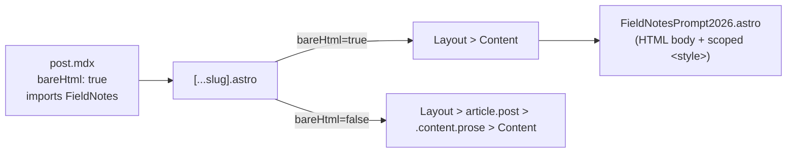

# Embed HTML Field Notes

## Goal

Publish a second draft post alongside [2026-04-16-field-notes-prompt-2026.mdx](src/content/posts/2026-04-16-field-notes-prompt-2026.mdx) that renders the editorial design from `flowtopia-field-notes.html` pixel-for-pixel, so Miguel can compare the two renderings side-by-side. The HTML version must appear in the blog index listing.

The existing markdown post stays byte-identical.

## Decision log

**Picked: "Astro component imported from a thin MDX post."** The post file is ~10 lines of frontmatter + one import + one tag. A dedicated [src/components/FieldNotesPrompt2026.astro](src/components/FieldNotesPrompt2026.astro) holds the full HTML body and a `<style is:global>` block with the CSS pasted verbatim.

Why this over the alternatives we considered:

- **vs. standalone `.astro` page under `src/pages/blog/`**: simpler in isolation but bypasses the content collection, so the post wouldn't appear in the `/blog/` index listing. User requirement: must be listed.
- **vs. single-file `.mdx` with CSS in backticks**: saves one file but loses CSS editor tooling (no syntax highlighting / autocomplete / linting). The component pattern keeps both in one file *with* editor support.
- **vs. `.mdx` + separate `.css` file**: works, but splits structure and style across two files that will always move together. The component keeps them colocated in one file, which is closer to the user's original intuition ("I really would like the styles in the same file so we don't have to maintain two files").
- **vs. upgrading the global prose styles in `[...slug].astro`**: that's the right move if the design proves out *for all posts*, but it's a much bigger scope change affecting 40+ existing posts. The component approach leaves that door open for later without committing to it now.

### Why `<style is:global>` and not the default scoped styles

Reviewed after the first plan draft. The source HTML has rules directly on `body` (font-family, paper background, radial gradient — lines 27-37 of `flowtopia-field-notes.html`). Astro's default scoping rewrites selectors to match a `data-astro-cid-*` attribute on elements *inside the component*; `<body>` sits outside the component, so those rules would silently stop matching and the design would break. Using `is:global` preserves verbatim paste.

This does *not* weaken the "CSS can't leak to other posts" property. Astro only bundles a component's `is:global` CSS into pages that actually import the component. Since only the new HTML post imports `FieldNotesPrompt2026.astro`, its CSS reaches exactly one page — the one we want.

Reusability note: the same pattern (`import Thing from '../../components/Thing.astro'; <Thing />` inside a minimal MDX post) scales to any future one-off bespoke design without re-litigating this decision.

## Why this needs more than a copy-paste

Two things in the existing pipeline will flatten the HTML's design if we don't address them:

1. **The prose wrapper.** [src/pages/blog/[...slug].astro](src/pages/blog/[...slug].astro) wraps every post in `<article class="post">` with `max-width: 42rem` and a long list of `.content :global(h2/h3/p/ul/a/img/blockquote)` rules (lines 65–146). Those will override the HTML's `.section-title`, `.challenge h3`, etc., even if our component has its own scoped styles — the wrapper sits outside the component.
2. **CSP blocks Google Fonts.** [src/layouts/Layout.astro](src/layouts/Layout.astro) line 19 has no `font-src` at all and `style-src` doesn't list `fonts.googleapis.com`. Fraunces / IBM Plex Sans / IBM Plex Mono will not load.

## Mechanism: a `bareHtml` opt-out flag

Add an optional `bareHtml` boolean to the post schema. When true, [src/pages/blog/[...slug].astro](src/pages/blog/[...slug].astro) renders `<Content />` directly under `<Layout>` — no `.post` wrapper, no `.content.prose` div, no default `<h1>`/`<time>` header (the HTML has its own masthead), no `#lightbox` div. The hoisted lightbox `<script>` (lines 149-167) is left alone: it does `document.querySelectorAll('.content img')` which returns an empty NodeList when `.content` isn't in the DOM, so it's a harmless no-op in the bare branch. Every other post stays identical.



## Files to create

### [src/components/FieldNotesPrompt2026.astro](src/components/FieldNotesPrompt2026.astro)

Full self-contained component:

```astro
---
// no props
---
<main class="page">
  …body of flowtopia-field-notes.html verbatim, from <header class="masthead"> through <footer class="colophon">…
</main>

<style is:global>
  @import url('https://fonts.googleapis.com/css2?family=Fraunces:ital,opsz,wght@0,9..144,400;0,9..144,500;0,9..144,600;1,9..144,400&family=IBM+Plex+Mono:wght@400;500&family=IBM+Plex+Sans:wght@400;500;600&display=swap');

  :root {
    --ink: #1a1814;
    --ink-soft: #4a4640;
    …
  }
  …all ~567 lines of CSS from the original <style> block, pasted verbatim…
</style>
```

Key points:
- `<style is:global>` is required (not scoped). Reason explained in the Decision log above: the source CSS has `body { … }` rules that scoped selectors would fail to match.
- `@import url('https://fonts.googleapis.com/...')` must be the **first** at-rule in the `<style>` block (per CSS spec). This replaces the three `<link>` tags the original HTML used in its `<head>`, since `<link>` tags inside a component body don't hoist reliably.
- No MDX-compatibility fixes needed — we're in `.astro`, not `.mdx`. Astro accepts real HTML including `<br>`, unclosed ``, and `{` inside `<style>`. Verbatim paste works.

### [src/content/posts/2026-04-16-field-notes-prompt-2026-html.mdx](src/content/posts/2026-04-16-field-notes-prompt-2026-html.mdx)

The entire post file:

```mdx
---
title: "Field notes — Prompt 2026 (HTML version)"
description: "Same field notes, rendered via a bespoke editorial HTML design for side-by-side comparison with the markdown version."
date: "2026-04-16"
image: "/images/2026-04-16/prompt-2026-audience.png"
draft: true
bareHtml: true
---

import FieldNotes from '../../components/FieldNotesPrompt2026.astro';

<FieldNotes />
```

Reuses the same `image` for OG/social sharing so the two posts look related on the index.

## Files to modify

### [src/content.config.ts](src/content.config.ts)

Add one optional field:

```ts
schema: z.object({
  title: z.string(),
  description: z.string(),
  date: z.string(),
  image: z.string().startsWith('/'),
  draft: z.boolean().optional().default(false),
  bareHtml: z.boolean().optional().default(false),  // new
}),
```

Optional + default means every existing post keeps validating unchanged.

### [src/pages/blog/[...slug].astro](src/pages/blog/[...slug].astro)

Branch on `post.data.bareHtml`. Sketch:

```astro
<Layout title={post.data.title}>
  { post.data.bareHtml ? (
      <Content />
  ) : (
    <>
      <article class="post">
        <header>…</header>
        <div class="content prose prose-slate max-w-none">
          <Content />
        </div>
      </article>
      <div id="lightbox" class="lightbox"></div>
    </>
  )}
</Layout>
```

The existing `<style>` and `<script>` blocks at the bottom of the file are **left untouched**. The styles are scoped to `.post` / `.content` selectors which don't exist in the bare branch, so they don't apply there. The script's `document.querySelectorAll('.content img')` returns an empty NodeList in the bare branch — no errors, no action. Not gating the script keeps the Astro hoisting behaviour simple.

### [src/layouts/Layout.astro](src/layouts/Layout.astro)

Extend the CSP on line 19 with two additions:

- `style-src` gets `https://fonts.googleapis.com`
- Add `font-src 'self' https://fonts.gstatic.com` (there is no `font-src` today, so fonts currently fall back to `default-src 'self'`).

Resulting relevant chunk:

```
style-src 'self' 'unsafe-inline' https://fonts.googleapis.com;
font-src 'self' https://fonts.gstatic.com;
```

Alternative if CSP changes feel too invasive: self-host the three font families under `public/fonts/` and replace the `@import` with `@font-face` declarations. More files, zero CSP change. Default plan: update CSP — it's two tokens.

## What this does *not* change

- The existing markdown post [2026-04-16-field-notes-prompt-2026.mdx](src/content/posts/2026-04-16-field-notes-prompt-2026.mdx) stays byte-identical.
- All other blog posts render exactly as today (no `bareHtml` flag → default branch).
- The nav / footer / cookie banner still wrap the HTML version, so it looks like part of the site, not a floating artifact.
- Both drafts appear on the local-dev blog index (since [src/pages/blog/index.astro](src/pages/blog/index.astro) includes drafts in `import.meta.env.DEV`). Neither appears on the live site until `draft: true` is removed.

## Known minor cosmetic differences from the standalone HTML

Not defects, just things to expect when comparing:

- **Top whitespace.** [src/layouts/Layout.astro](src/layouts/Layout.astro) adds `pt-[72px]` to `<body>` (to clear the fixed header), which stacks with the HTML's `.page { padding: 80px ... }` → ~152px of top whitespace vs 80px in the standalone file. Easy to trim later (e.g. reduce `.page` top padding) if the user doesn't like it.
- **Scrollbars / viewport background.** The HTML's `body` rules now apply to the blog page's body (via `is:global`), so the paper background and radial gradients replace the default site background on this post only. Expected.

## Verification after the edits

- `docker compose up --build`, open both URLs side-by-side:
  - `http://localhost:4444/blog/2026-04-16-field-notes-prompt-2026/` (markdown, unchanged)
  - `http://localhost:4444/blog/2026-04-16-field-notes-prompt-2026-html/` (new HTML version)
- Confirm both posts appear on `http://localhost:4444/blog/`.
- DevTools → Network, filter `fonts.gstatic.com`, confirm the three font families load without CSP errors.
- Resize to mobile width, confirm the responsive `@media (max-width: 680px)` rules from the HTML kick in.

## Todos

Done:

- [x] Create `src/components/FieldNotesPrompt2026.astro` with the full HTML body and `<style is:global>` block (CSS verbatim + Google Fonts `@import`).
- [x] Add optional `bareHtml` flag to the posts schema in `src/content.config.ts`.
- [x] Branch `src/pages/blog/[...slug].astro` on `bareHtml` to skip the `.post` / `.content` wrapper.
- [x] Extend CSP in `src/layouts/Layout.astro` to allow Google Fonts (`style-src` + `font-src`).
- [x] Create `src/content/posts/2026-04-16-field-notes-prompt-2026-html.mdx` (frontmatter + import + `<FieldNotes />`).
- [x] Run locally and eyeball both posts side-by-side; confirm fonts load with no CSP errors.

Pending (follow-up batch — do not execute until user says go):

- [ ] **Cover image.** Add `/images/2026-04-16/prompt-2026-audience.png` at the top of `FieldNotesPrompt2026.astro` (after the masthead / lede, before section 01) so the HTML version opens with the same hero as the markdown post.
- [ ] **Panel image.** Add `/images/2026-04-16/prompt-2026-panel.png` inside `FieldNotesPrompt2026.astro` at the same position as the markdown post — between section 01 ("outcomes over output") and section 02's "More concurrent agents" pushback.
- [ ] **Delete markdown post.** Remove `src/content/posts/2026-04-16-field-notes-prompt-2026.mdx` — the HTML version replaces it.
- [ ] **Publish HTML version.** Remove `draft: true` from `src/content/posts/2026-04-16-field-notes-prompt-2026-html.mdx` so it publishes to the live site.

Note: the value stream map is already present in `FieldNotesPrompt2026.astro` as inline SVG, so no todo for it.
