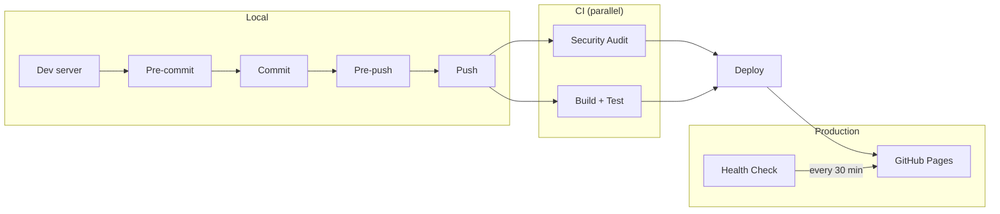

# Landing Page

```bash
docker compose up --build
```

```bash
http://localhost:4444
```

Draft posts are visible on localhost and hidden on the live site.

## TODO

* check out the RSS feed - is it working? can peopl subscribe to it?

## Lean Coffee Email Signup

The lean coffee page (`/lean-coffee`) collects emails via [Supascribe](https://supascribe.com), which syncs subscribers to the Substack publication at [valuestreammapping.substack.com](https://valuestreammapping.substack.com).

**How it works:**
- Supascribe widget renders a subscribe form directly on the page (no redirect)
- Subscribers are synced to Substack automatically
- Substack handles double opt-in, unsubscribe, GDPR compliance, and bounce management

**Dashboard & config:**
- Supascribe embed settings: https://supascribe.com/embed/XGvhahzgY3hvGZSrhva9
- Substack publication dashboard: https://valuestreammapping.substack.com/publish
- Export subscribers anytime from Substack: Dashboard → Settings → Exports

**To change widget styling** (colors, button text, success message), edit the embed in the [Supascribe dashboard](https://supascribe.com/embed/XGvhahzgY3hvGZSrhva9). Changes are live instantly — no code changes needed.

## Run locally

```bash
docker compose up --build
```

## Install git hooks

Use git's "half-arsed-builtin" version control for git hooks (this is too verbose?)
```bash
touch .githooks/pre-push
chmod +x .githooks/pre-push
git config core.hooksPath .githooks
```

## Deployment Pipeline



| Step | What it does |
|------|-------------|
| **Dev server** | `docker compose up --build` — drafts visible, HMR |
| **Pre-commit** | Tests against running server, no rebuild |
| **Pre-push** | Rebuilds production artifact, tests it, switches back to dev |
| **Security Audit** | npm audit, pip audit, gitleaks |
| **Build + Test** | Builds `dist/`, serves it, runs the Python test suite |
| **Deploy** | Deploys the tested `dist/` to GitHub Pages |
| **Health Check** | Curls migueldias.eu every 30 min |

The pipeline follows continuous delivery principles:

- **Build once, deploy many** — CI builds `dist/`, tests it, and deploys that same artifact. No second build.
- **CI is the gate** — local hooks provide fast feedback but can be bypassed (`--no-verify`). CI catches anything that slips through. Nothing reaches production untested.
- **Trunk-based development** — push directly to main in small batches. No PRs or feature branches. Smaller batches = smaller blast radius = cheaper to fix.
- **Docker is for local portability** — change laptop, install Docker, `docker compose up --build`, done. Production is static files on a CDN, not a container.

## Security

Three layers prevent secrets from reaching production:

1. **Pre-commit/pre-push hooks** — `detect-secrets` scans the working tree for hardcoded credentials as part of the test suite. Blocks the commit before secrets enter git history.
2. **CI (GitHub Actions)** — `gitleaks` scans the full git history on every push to main. Catches anything committed in the past or if hooks were bypassed.
3. **Deployment gate** — GitHub Pages deploy only runs after both the Security Audit and Build+Test workflows pass. Failed checks block deployment.

Git hooks are the first line of defense but can be bypassed (`--no-verify`) or missed after a fresh clone. Make sure to run `git config core.hooksPath .githooks` after cloning.

## How to Take a Scrolling Screenshot on Mac

### Using Chrome DevTools:
1. Open your website in **Google Chrome**.
2. Zoom out using **Cmd + Minus (–)** until the full page fits your screen.
3. Open DevTools with **Cmd + Option + I**.
4. Open the **Command Menu** with **Cmd + Shift + P**.
5. Type `"Capture full size screenshot"` and press **Enter**.

### Alternative Methods:
- **Firefox:** Right-click > "Take Screenshot" > "Save Full Page".
- **Third-Party Apps:**
  - **Snagit** (Paid, feature-rich)
  - **Capto** (Mac-exclusive, scrolling capture)
  - **Shottr** (Free, lightweight)

This method works best for capturing entire web pages without manually stitching screenshots together.
