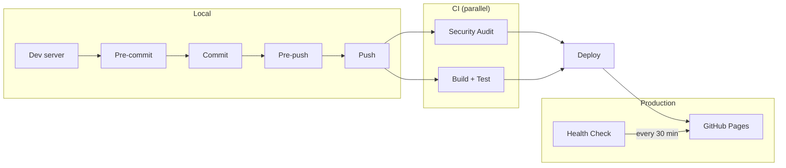

# Landing Page

```bash
docker compose up --build
```

```bash
http://localhost:4444
```

Draft posts are visible on localhost and hidden on the live site.

## Lean Coffee Email Signup

The lean coffee page (`/lean-coffee`) collects emails via [Supascribe](https://supascribe.com), which syncs subscribers to the Substack publication at [valuestreammapping.substack.com](https://valuestreammapping.substack.com).

**Dashboard & config:**
- Supascribe embed settings: https://supascribe.com/embed/XGvhahzgY3hvGZSrhva9
- Substack publication dashboard: https://valuestreammapping.substack.com/publish
- Export subscribers anytime from Substack: Dashboard → Settings → Exports

**To change widget styling** (colors, button text, success message), edit the embed in the [Supascribe dashboard](https://supascribe.com/embed/XGvhahzgY3hvGZSrhva9). Changes are live instantly — no code changes needed.

## Run locally

```bash
docker compose up --build
```

## Install git hooks

Use git's "half-arsed-builtin" version control for git hooks (this is too verbose?)
```bash
touch .githooks/pre-push
chmod +x .githooks/pre-push
git config core.hooksPath .githooks
```

## Deployment Pipeline



## Backlog

- **Upgrade astro 5 → 7 (breaking) — the npm-audit gate is currently OFF.** Astro 5 and its transitive `sharp` have open advisories (XSS, SSRF, AVIF RCE, libvips/libheif CVEs). They have now escalated from *high* to **critical** (`GHSA-26w7-cxv4-gfx2`), so the earlier `--audit-level=critical` relaxation no longer covers them, and there is no 5.x backport — the advisory range is `astro <=7.2.7`. As a stopgap the gate is silenced, not relaxed:
  - `tests/test_security.py` — `test_npm_audit_no_high_or_higher_vulnerabilities` is `@unittest.skip`ped.
  - `.github/workflows/security.yml` and `deploy.yml` — the `npm-audit` job is `continue-on-error: true`. **This un-gates `deploy`, which `needs: npm-audit`; deploys now proceed on a failing audit.**

  Undo all three once the migration lands, and restore the level to `high`. The upgrade is not small: `@astrojs/tailwind` peers at `astro ^3 || ^4 || ^5` and is EOL at v6, so astro 7 means dropping it for Tailwind 4 + `@tailwindcss/vite` (CSS-first `@theme`, no `tailwind.config.js`, `@tailwindcss/typography` compat check). Node is fine — 22 everywhere, astro 7 needs ≥22.12. `@astrojs/mdx` goes to ^8.
- Smaller, independent win: a package.json `override` bumping `sharp` to `^0.35.4` clears the one `high` (libvips + libheif CVEs) without touching astro. Doesn't unblock the gate on its own, but this site does run images through sharp at build time.
- Pre-push waits ~60s before failing — should fail fast (shorter timeout).
- `scripts/ensure_server.py:67` failure message is useless: `Service 'web' not ready after 60s. Check: docker compose logs` tells you nothing about *why*. It should print the actual error — dump the tail of `docker compose logs web` (and the container's status/exit code) inline so `gacp` shows the real failure instead of making you go dig for it.
- Make `git push` faster (parallelize tests, skip checks CI already runs).
- `requirements.txt` hand-pins the full transitive dependency tree, so removing a direct dep (e.g. selenium) leaves orphaned sub-deps behind as dead weight and unnecessary attack surface. Fix: declare only direct deps in a `requirements.in` and generate a locked `requirements.txt` with `uv`/`pip-compile` (`--generate-hashes`), so transitive deps and version hashes are managed automatically.
- Automate the security vulnerability scan: run it periodically (scheduled GitHub Action) and have it open — and, when checks pass, auto-merge — a PR with the fixes, à la Steve Yegge's auto-maintenance workflow for his open-source projects. Could combine Dependabot/`npm audit fix` with an agent-driven step plus auto-merge on green CI.
