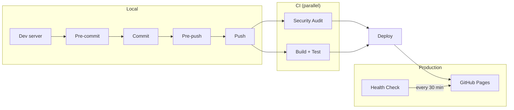

# Landing Page

```bash
docker compose up --build
```

```bash
http://localhost:4444
```

Draft posts are visible on localhost and hidden on the live site.

## Lean Coffee Email Signup

The lean coffee page (`/lean-coffee`) collects emails via [Supascribe](https://supascribe.com), which syncs subscribers to the Substack publication at [valuestreammapping.substack.com](https://valuestreammapping.substack.com).

**Dashboard & config:**
- Supascribe embed settings: https://supascribe.com/embed/XGvhahzgY3hvGZSrhva9
- Substack publication dashboard: https://valuestreammapping.substack.com/publish
- Export subscribers anytime from Substack: Dashboard → Settings → Exports

**To change widget styling** (colors, button text, success message), edit the embed in the [Supascribe dashboard](https://supascribe.com/embed/XGvhahzgY3hvGZSrhva9). Changes are live instantly — no code changes needed.

## Run locally

```bash
docker compose up --build
```

## Install git hooks

Use git's "half-arsed-builtin" version control for git hooks (this is too verbose?)
```bash
touch .githooks/pre-push
chmod +x .githooks/pre-push
git config core.hooksPath .githooks
```

## Deployment Pipeline


