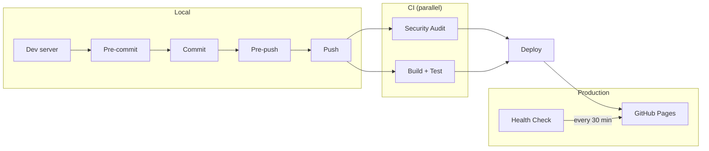

# Landing Page

```bash
docker compose up --build
```

```bash
http://localhost:4444
```

Draft posts are visible on localhost and hidden on the live site.

## Lean Coffee Email Signup

The lean coffee page (`/lean-coffee`) collects emails via [Supascribe](https://supascribe.com), which syncs subscribers to the Substack publication at [valuestreammapping.substack.com](https://valuestreammapping.substack.com).

**Dashboard & config:**
- Supascribe embed settings: https://supascribe.com/embed/XGvhahzgY3hvGZSrhva9
- Substack publication dashboard: https://valuestreammapping.substack.com/publish
- Export subscribers anytime from Substack: Dashboard → Settings → Exports

**To change widget styling** (colors, button text, success message), edit the embed in the [Supascribe dashboard](https://supascribe.com/embed/XGvhahzgY3hvGZSrhva9). Changes are live instantly — no code changes needed.

## Run locally

```bash
docker compose up --build
```

## Install git hooks

Use git's "half-arsed-builtin" version control for git hooks (this is too verbose?)
```bash
touch .githooks/pre-push
chmod +x .githooks/pre-push
git config core.hooksPath .githooks
```

## Deployment Pipeline



## Backlog

- **Upgrade astro 5 → 7 (breaking).** Astro 5 and its transitive `sharp` have open high-severity advisories (XSS, SSRF, libvips CVEs) whose only fix is `npm audit fix --force`, which installs astro@7.2.8 — a breaking change requiring a test pass. Until then the npm-audit gate is relaxed to `critical` in `tests/test_security.py`, `.github/workflows/security.yml`, and `.github/workflows/deploy.yml` (keep in sync). Restore it to `high` once the migration lands. Consider a package.json `override` to bump `sharp` on its own in the meantime.
- Pre-push waits ~60s before failing — should fail fast (shorter timeout).
- Make `git push` faster (parallelize tests, skip checks CI already runs).
- `requirements.txt` hand-pins the full transitive dependency tree, so removing a direct dep (e.g. selenium) leaves orphaned sub-deps behind as dead weight and unnecessary attack surface. Fix: declare only direct deps in a `requirements.in` and generate a locked `requirements.txt` with `uv`/`pip-compile` (`--generate-hashes`), so transitive deps and version hashes are managed automatically.
- Automate the security vulnerability scan: run it periodically (scheduled GitHub Action) and have it open — and, when checks pass, auto-merge — a PR with the fixes, à la Steve Yegge's auto-maintenance workflow for his open-source projects. Could combine Dependabot/`npm audit fix` with an agent-driven step plus auto-merge on green CI.
