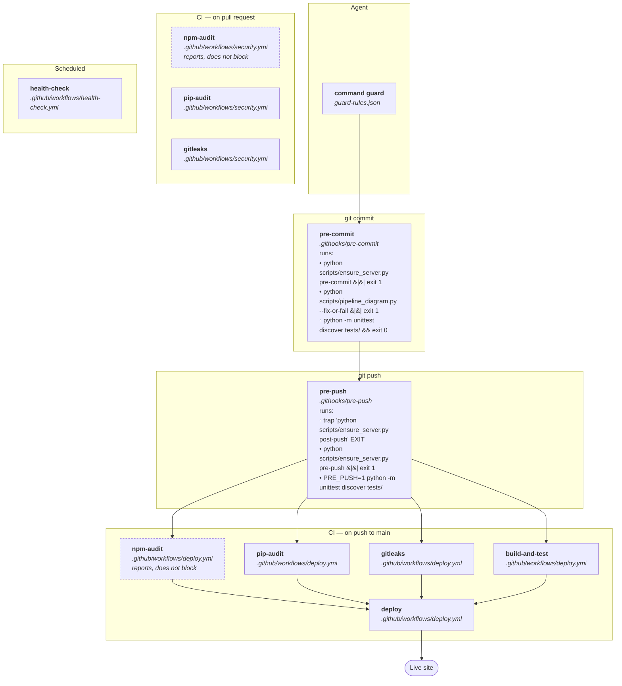

# Landing Page

```bash
# -d (detached) starts the containers and gives you your prompt back.
# Without it, the command stays in the foreground streaming logs and only
# ends on Ctrl+C -- which also stops the site. Agents hit that as a hang:
# the tool call blocks until it times out, so the guard always adds -d.
docker compose up --build -d
```

```bash
http://localhost:4444
```

```bash
docker compose logs -f web   # follow the logs
docker compose down          # stop it
```

Draft posts are visible on localhost and hidden on the live site.

## Lean Coffee Email Signup

The lean coffee page (`/lean-coffee`) collects emails via [Supascribe](https://supascribe.com), which syncs subscribers to the Substack publication at [valuestreammapping.substack.com](https://valuestreammapping.substack.com).

**Dashboard & config:**
- Supascribe embed settings: https://supascribe.com/embed/XGvhahzgY3hvGZSrhva9
- Substack publication dashboard: https://valuestreammapping.substack.com/publish
- Export subscribers anytime from Substack: Dashboard → Settings → Exports

**To change widget styling** (colors, button text, success message), edit the embed in the [Supascribe dashboard](https://supascribe.com/embed/XGvhahzgY3hvGZSrhva9). Changes are live instantly — no code changes needed.

## Run locally

```bash
docker compose up --build -d
```

## Agent guardrails

How to work in this repo is in [`CLAUDE.md`](CLAUDE.md); how I work everywhere — plans, TDD,
small batches — is in `~/.claude/CLAUDE.md`, mirrored in
[`dev-setup`](https://github.com/buedaswag/dev-setup).

The Docker-only part is enforced rather than trusted. The guard engine lives in `dev-setup`
and is shared across projects, registered as a `PreToolUse` hook in `~/.claude/settings.json`;
this repo supplies only [`guard-rules.json`](guard-rules.json). It checks every Bash command an
agent proposes, statically, before the permission prompt appears:

| Command                              | What happens                                                    |
| ------------------------------------ | --------------------------------------------------------------- |
| `npm install` / `npm ci` / `npm add` | Denied — add the dep to `package.json`, Docker installs it.       |
| any other `npm` / `npx` / `astro`    | Rewritten to `docker compose up --build -d` and run.              |
| anything containing `docker`         | Untouched.                                                        |

No prompt to answer and no LLM in the loop — it's a regex table in one file. The run command at
the top of this README is the source of truth; if it changes there, change `rewrite_to` in
`guard-rules.json` to match. Tests live with the engine, in `dev-setup`.

Plans for non-trivial work go in [`.claude/plans/`](.claude/plans/), one page each.

## Install git hooks

Use git's "half-arsed-builtin" version control for git hooks (this is too verbose?)
```bash
touch .githooks/pre-push
chmod +x .githooks/pre-push
git config core.hooksPath .githooks
```

### Why the gates sit where they do

A commit is a local save point. A push is the release boundary — `deploy.yml` fires on
push to `main`. The gates follow that split; *which* gate is where is in the generated
diagram below, not written out here, because a hand-kept copy of it drifted once already.

Blocking the commit caught no defect that pre-push and CI didn't already catch; it only
grew the uncommitted worktree — harder to review, harder to bisect, nothing to roll back
to, and worse still with several agents checkpointing into one tree. Relaxing it is *not*
a licence for `--no-verify`: the aim is to leave no reason to reach for it.

## Deployment Pipeline

Everything from a command an agent proposes to the live site. Dashed boxes and
`◦` steps report; everything else stops the pipeline when it fails.

This diagram is **generated from the pipeline itself** — the git hooks, the
workflow files, and `guard-rules.json` — by `scripts/pipeline_diagram.py`.
Nothing below is hand-written, which is the point: it used to be described in
five places and they drifted apart. Whether a hook gates is declared in the
hook, on a `# pipeline:` line next to the command it describes, and
`tests/test_pipeline_gates.py` runs the hooks to prove those lines are true.

<!-- pipeline:start -->
<!-- Generated by scripts/pipeline_diagram.py from the hooks and
     workflows themselves. Do not edit by hand: pre-commit regenerates
     this whenever it goes stale. -->


```mermaid
graph TD
    subgraph agent["Agent"]
        command_guard["<div style='text-align:left'><b>command guard</b><br/><i>guard-rules.json</i></div>"]
    end
    subgraph commit["git commit"]
        pre_commit["<div style='text-align:left'><b>pre-commit</b><br/><i>.githooks/pre-commit</i><br/>runs:<br/>• python scripts/ensure_server.py pre-commit &#124;&#124; exit 1<br/>• python scripts/pipeline_diagram.py --fix-or-fail &#124;&#124; exit 1<br/>◦ python -m unittest discover tests/ &amp;&amp; exit 0</div>"]
    end
    subgraph push["git push"]
        pre_push["<div style='text-align:left'><b>pre-push</b><br/><i>.githooks/pre-push</i><br/>runs:<br/>◦ trap 'python scripts/ensure_server.py post-push' EXIT<br/>• python scripts/ensure_server.py pre-push &#124;&#124; exit 1<br/>• PRE_PUSH=1 python -m unittest discover tests/</div>"]
    end
    subgraph ci["CI — on push to main"]
        deploy_npm_audit["<div style='text-align:left'><b>npm-audit</b><br/><i>.github/workflows/deploy.yml</i><br/><i>reports, does not block</i></div>"]
        deploy_pip_audit["<div style='text-align:left'><b>pip-audit</b><br/><i>.github/workflows/deploy.yml</i></div>"]
        deploy_gitleaks["<div style='text-align:left'><b>gitleaks</b><br/><i>.github/workflows/deploy.yml</i></div>"]
        deploy_build_and_test["<div style='text-align:left'><b>build-and-test</b><br/><i>.github/workflows/deploy.yml</i></div>"]
        deploy_deploy["<div style='text-align:left'><b>deploy</b><br/><i>.github/workflows/deploy.yml</i></div>"]
    end
    subgraph pr["CI — on pull request"]
        security_npm_audit["<div style='text-align:left'><b>npm-audit</b><br/><i>.github/workflows/security.yml</i><br/><i>reports, does not block</i></div>"]
        security_pip_audit["<div style='text-align:left'><b>pip-audit</b><br/><i>.github/workflows/security.yml</i></div>"]
        security_gitleaks["<div style='text-align:left'><b>gitleaks</b><br/><i>.github/workflows/security.yml</i></div>"]
    end
    subgraph scheduled["Scheduled"]
        health_check_health_check["<div style='text-align:left'><b>health-check</b><br/><i>.github/workflows/health-check.yml</i></div>"]
    end
    live(["Live site"])
    command_guard --> pre_commit
    pre_commit --> pre_push
    pre_push --> deploy_npm_audit
    pre_push --> deploy_pip_audit
    pre_push --> deploy_gitleaks
    pre_push --> deploy_build_and_test
    deploy_npm_audit --> deploy_deploy
    deploy_pip_audit --> deploy_deploy
    deploy_gitleaks --> deploy_deploy
    deploy_build_and_test --> deploy_deploy
    deploy_deploy --> live
    classDef reports stroke-dasharray: 4 3
    class deploy_npm_audit,security_npm_audit reports
```
<!-- pipeline:end -->

## Migration

- **[Astro 5 → 7](ASTRO_MIGRATION.md)** — pending. Astro 5 is on an unsupported line with open critical advisories; the npm-audit gate is silenced until this lands.

## Backlog

- **Upgrade astro 5 → 7 (breaking) — the npm-audit gate is currently OFF.** Astro 5 and its transitive `sharp` have open advisories (XSS, SSRF, AVIF RCE, libvips/libheif CVEs). They have now escalated from *high* to **critical** (`GHSA-26w7-cxv4-gfx2`), so the earlier `--audit-level=critical` relaxation no longer covers them, and there is no 5.x backport — the advisory range is `astro <=7.2.7`. As a stopgap the gate is silenced, not relaxed:
  - `tests/test_security.py` — `test_npm_audit_no_high_or_higher_vulnerabilities` is `@unittest.skip`ped.
  - `.github/workflows/security.yml` and `deploy.yml` — the `npm-audit` job is `continue-on-error: true`. **This un-gates `deploy`, which `needs: npm-audit`; deploys now proceed on a failing audit.**

  Undo all three once the migration lands, and restore the level to `high`. Scope and steps: **[ASTRO_MIGRATION.md](ASTRO_MIGRATION.md)**.
- Smaller, independent win: a package.json `override` bumping `sharp` to `^0.35.4` clears the one `high` (libvips + libheif CVEs) without touching astro. Doesn't unblock the gate on its own, but this site does run images through sharp at build time.
- Pre-push waits ~60s before failing — should fail fast (shorter timeout).
- `scripts/ensure_server.py:67` failure message is useless: `Service 'web' not ready after 60s. Check: docker compose logs` tells you nothing about *why*. It should print the actual error — dump the tail of `docker compose logs web` (and the container's status/exit code) inline so `gacp` shows the real failure instead of making you go dig for it.
- Make `git push` faster (parallelize tests, skip checks CI already runs).
- `requirements.txt` hand-pins the full transitive dependency tree, so removing a direct dep (e.g. selenium) leaves orphaned sub-deps behind as dead weight and unnecessary attack surface. Fix: declare only direct deps in a `requirements.in` and generate a locked `requirements.txt` with `uv`/`pip-compile` (`--generate-hashes`), so transitive deps and version hashes are managed automatically.
- Static check on worktree size after each LLM call, wired as a `PostToolUse`/`Stop` hook. Diff size (files changed + lines) accumulates silently across an agent session until the working tree is too big to review or revert cleanly. The hook would measure `git status --porcelain` / `git diff --stat` against a threshold and fire an alert into the transcript so the agent knows it's time to commit. Natural extension, and consistent with continuous delivery: once the threshold trips, commit automatically (small, frequent, always-green commits) rather than just warning — gated on the existing pre-commit checks passing, so a red tree alerts instead of committing.
- **Cap unpushed commits (batch-size limit, ~3).** Now that pre-commit only reports, the pressure that kept batches small is gone — commits can pile up locally instead of the worktree piling up. Same inventory, one stage later. Fix: a static check counting `git rev-list --count @{u}..HEAD`; at the limit, stop and push, or push automatically. Auto-push is safe *because* pre-push blocks on red — a failing suite means the push simply doesn't happen, and you're told why. Open questions: which hook fires it (`post-commit` can't refuse a commit that already exists, so it's alert-or-push, not gate); what to do on no upstream or a detached HEAD; whether an auto-push on `main` is wanted given `deploy.yml` fires on it; and whether the limit should count commits or lines. Pairs with the worktree-size hook above — same idea (bound the unreviewed/unreleased batch), different stage.
- Automate the security vulnerability scan: run it periodically (scheduled GitHub Action) and have it open — and, when checks pass, auto-merge — a PR with the fixes, à la Steve Yegge's auto-maintenance workflow for his open-source projects. Could combine Dependabot/`npm audit fix` with an agent-driven step plus auto-merge on green CI.
