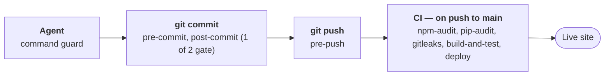

# Landing Page

```bash
# -d (detached) starts the containers and gives you your prompt back.
# Without it, the command stays in the foreground streaming logs and only
# ends on Ctrl+C -- which also stops the site. Agents hit that as a hang:
# the tool call blocks until it times out, so the guard always adds -d.
docker compose up --build -d
```

```bash
http://localhost:4444
```

```bash
docker compose logs -f web   # follow the logs
docker compose down          # stop it
```

Draft posts are visible on localhost and hidden on the live site.

## Lean Coffee Email Signup

The lean coffee page (`/lean-coffee`) collects emails via [Supascribe](https://supascribe.com), which syncs subscribers to the Substack publication at [valuestreammapping.substack.com](https://valuestreammapping.substack.com).

**Dashboard & config:**
- Supascribe embed settings: https://supascribe.com/embed/XGvhahzgY3hvGZSrhva9
- Substack publication dashboard: https://valuestreammapping.substack.com/publish
- Export subscribers anytime from Substack: Dashboard → Settings → Exports

**To change widget styling** (colors, button text, success message), edit the embed in the [Supascribe dashboard](https://supascribe.com/embed/XGvhahzgY3hvGZSrhva9). Changes are live instantly — no code changes needed.

## Run locally

```bash
docker compose up --build -d
```

## Agent guardrails

How to work in this repo is in [`CLAUDE.md`](CLAUDE.md); how I work everywhere — plans, TDD,
small batches — is in `~/.claude/CLAUDE.md`, mirrored in
[`dev-setup`](https://github.com/buedaswag/dev-setup).

The Docker-only part is enforced rather than trusted. The guard engine lives in `dev-setup`
and is shared across projects, registered as a `PreToolUse` hook in `~/.claude/settings.json`;
this repo supplies only [`.claude/guard-rules.json`](.claude/guard-rules.json). It checks every Bash command an
agent proposes, statically, before the permission prompt appears:

| Command                              | What happens                                                    |
| ------------------------------------ | --------------------------------------------------------------- |
| `npm install` / `npm ci` / `npm add` | Denied — add the dep to `package.json`, Docker installs it.       |
| any other `npm` / `npx` / `astro`    | Rewritten to `docker compose up --build -d` and run.              |
| anything containing `docker`         | Untouched.                                                        |

No prompt to answer and no LLM in the loop — it's a regex table in one file. `rewrite_to` is the run
command at the top of this README, which is what [`docker-compose.yml`](docker-compose.yml)
runs. Tests live with the engine, in `dev-setup`.

Plans for non-trivial work go in [`.claude/plans/`](.claude/plans/), one page each.

## Install git hooks

Use git's "half-arsed-builtin" version control for git hooks (this is too verbose?)
```bash
touch .githooks/pre-push
chmod +x .githooks/pre-push
git config core.hooksPath .githooks
```

### Why the gates sit where they do

A commit is a local save point. A push is the release boundary — `deploy.yml` fires on
push to `main`. The gates follow that split; *which* gate is where is in the generated
diagram below, not written out here, because a hand-kept copy of it drifted once already.

Blocking the commit caught no defect that pre-push and CI didn't already catch; it only
grew the uncommitted worktree — harder to review, harder to bisect, nothing to roll back
to, and worse still with several agents checkpointing into one tree. Relaxing it is *not*
a licence for `--no-verify`: the aim is to leave no reason to reach for it.

## Deployment Pipeline

Everything from a command an agent proposes to the live site. **Full detail, with every
command each stage runs: [`docs/pipeline.md`](docs/pipeline.md).**

<!-- pipeline:start -->
[](docs/pipeline.md)

<sub>Generated from the hooks and workflows. Full detail: [`docs/pipeline.md`](docs/pipeline.md).</sub>

<details><summary>Shape, in text</summary>


```mermaid
graph LR
    agent["<b>Agent</b><br/>command guard"]
    commit["<b>git commit</b><br/>pre-commit, post-commit (1 of 2 gate)"]
    push["<b>git push</b><br/>pre-push"]
    ci["<b>CI — on push to main</b><br/>npm-audit, pip-audit, gitleaks, build-and-test, deploy"]
    agent --> commit
    commit --> push
    push --> ci
    ci --> live([Live site])
```

</details>
<!-- pipeline:end -->

Both views are **generated from the pipeline itself** — the git hooks, the workflow files and
`.claude/guard-rules.json` — by `scripts/pipeline_diagram.py`. None of it is written by hand,
which is the point: the pipeline used to be described in five places and they drifted apart.

Whether a step gates is declared in the hook, on a `# pipeline:` line above the command it
describes; `tests/test_pipeline_gates.py` runs the hooks to prove those lines are true. A
stale diagram never blocks a commit — `.githooks/post-commit` redraws it in a follow-up
commit — but the drift check is a test, so pre-push and CI both refuse it.

## Migration

- **[Astro 5 → 7](ASTRO_MIGRATION.md)** — done 2026-09-27. Astro 7 and Tailwind 4; the npm-audit gate blocks again at `high`.

## Backlog

- Pre-push waits ~60s before failing — should fail fast (shorter timeout).
- `scripts/ensure_server.py:67` failure message is useless: `Service 'web' not ready after 60s. Check: docker compose logs` tells you nothing about *why*. It should print the actual error — dump the tail of `docker compose logs web` (and the container's status/exit code) inline so `gacp` shows the real failure instead of making you go dig for it.
- Make `git push` faster (parallelize tests, skip checks CI already runs).
- `requirements.txt` hand-pins the full transitive dependency tree, so removing a direct dep (e.g. selenium) leaves orphaned sub-deps behind as dead weight and unnecessary attack surface. Fix: declare only direct deps in a `requirements.in` and generate a locked `requirements.txt` with `uv`/`pip-compile` (`--generate-hashes`), so transitive deps and version hashes are managed automatically.
- Automate the security vulnerability scan: run it periodically (scheduled GitHub Action) and have it open — and, when checks pass, auto-merge — a PR with the fixes, à la Steve Yegge's auto-maintenance workflow for his open-source projects. Could combine Dependabot/`npm audit fix` with an agent-driven step plus auto-merge on green CI.
- **`docs/pipeline.md` stops at deploy — carry it on into production monitoring.** The diagram ends where the release does, so nothing in it says how I find out the site is broken, or whether anyone visited. Two things to add, and they are not the same kind of work:
  - **`health-check.yml`** — `curl` against `https://migueldias.eu` every 30 min, failing the run on any non-200. It is already a workflow file, so `scripts/pipeline_diagram.py` can reach it; it is missing because the generator walks the push→deploy chain and this one hangs off `schedule`, not `push`. Needs a second entry point, not a new data source.
  - **GA4 visitor analytics** — `gtag` in `src/layouts/Layout.astro`, consent-gated by `CookieBanner.astro`. This one *is* a new data source: it lives in page source, not in a hook, a workflow, or `.claude/guard-rules.json`, so the generator has nothing to read it from today.

  Keep the generated-not-hand-written property while doing it — a hand-added monitoring box is exactly the drift the generator exists to prevent.
